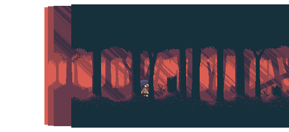
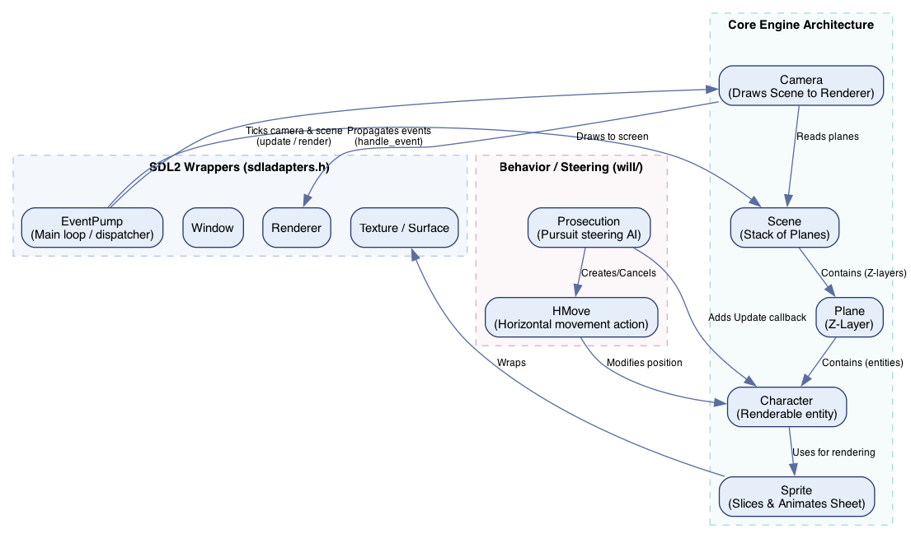

# tv_studio

[](https://github.com/ignacionr/tv_studio/actions/workflows/ci.yml)

A simple 2D C++ game/simulation framework built on top of the SDL2 framework (using SDL2, SDL2_image, and SDL2_ttf).



---

## 🎯 Core Goal & Vision

The central goal of this repository is to construct a lightweight, educational C++ framework that enables **high-level, expressive formulation of relatively complex 2D scenes**. 

Instead of forcing developer-students to write redundant boilerplate, hardcode render-loops, or manually translate coordinates, the framework uses clean composition patterns (such as combining behavior updates with `operator+=`) and generic parametric programming (templates) to let students express sophisticated layers, animated characters, event routing, and AI steering behaviors in an elegant, declarative-like style.

---

## 🏛️ Engine Architecture

The framework is organized into three main layers: **SDL2 Wrapper Utilities**, the **Core Engine Architecture**, and the **Behavior/Steering** layer.

Below is a visualization of the architecture:



### 1. SDL2 Wrappers (`src/sdladapters.h`)
* **`EventPump`**: Manages the main game loop (`SDL_WaitEventTimeout`) and routes input events to registered handlers.
* **`Window` & `Renderer`**: Encapsulate creation and lifetime management of `SDL_Window` and `SDL_Renderer`.
* **`Texture` & `Surface`**: RAII wrappers for image buffers and loaded sprites.
* **`Font`**: Manages TrueType fonts (`SDL2_ttf`) for text rendering.

### 2. Core Engine Components (`src/`)
* **`Scene`** ([scene.h](src/scene.h)): Composes a list of overlapping `Plane` layers of identical dimensions. Manages global simulation time (`age()`) and propagates tick updates and events downward.
* **`Plane`** ([plane.h](src/plane.h)): Represents a depth layer (Z-index) containing a background image and list of renderable entities.
* **`Character`** ([character.h](src/character.h)): Any renderable entity placed on a plane. Can contain a list of custom behavior lambdas (`_update`) combined using `operator+=` and an event listener callback (`_react`).
* **`Sprite`** ([sprite.h](src/sprite.h)): Binds to a `Character` to slice sprite sheets, maintain animation states (e.g. walk left/right), and perform rendering.
* **`Camera`** ([camera.h](src/camera.h)): Translates the `Scene` coordinates to the screen, updating the viewport scroll offsets. Includes support for real-time coordinate debug overlay rendering and frame-capturing.

### 3. Steering & Behaviors
* **`HMove`** ([move.h](src/move.h)): A horizontal movement behavior that increments/decrements a character's horizontal (`x`) position over time using simulation metrics (`units::Speed`).
* **`VMove`** ([move.h](src/move.h)): A vertical movement behavior that increments/decrements a character's vertical (`y`) position over time using simulation metrics (`units::Speed`).
* **`Prosecution`** ([will/prosecution.h](src/will/prosecution.h)): A pursuit AI steering behavior that controls a character to track and steer towards target coordinate endpoints.
* **`Jump`** ([will/jump.h](src/will/jump.h)): A compound jumping behavior that manages state transitions between ascending and descending phases using vertical movement updates (`VMove`).

---

## 🎬 Demo Scene Implementations

The framework provides two primary educational scenes illustrating its capabilities:

### 1. Forest Scene (`ForestScene` defined in [forest.h](src/scenes/forest.h))
*Executed by default, this scene demonstrates:*
* **Parallax Background Layers**: Multi-layered scenery comprising background planes that scroll relative to the focus plane depth:
  - Plane 4: `rsrc/backgrounds/bg.png`
  - Plane 3: `rsrc/backgrounds/far_trees.png`
  - Plane 2: `rsrc/backgrounds/mid_trees.png` (focus plane)
  - Plane 0: `rsrc/backgrounds/close_trees.png`
* **Steering AI Interaction**:
  - A static **Ice block** (`ice`) is placed on Plane 1.
  - A **Kanako character** (`girl`) is placed on Plane 2.
  - The `girl` runs a `Prosecution` script targeting the `ice` block. As she walks, the animation ticks only during movement, resetting to an idle state when stationary.

### 2. Ice Scene (`IceScene` defined in [ice.h](src/scenes/ice.h))
*An alternate demo scene showcasing:*
* A custom background landscape (`rsrc/IMG_6110.jpg`).
* A static **Ice block** on Plane 1 and a **Cat character** on Plane 2.
* The camera set to follow the **Cat** as it traverses the scene.

---

## ⚙️ Command-Line Arguments

The application accepts command-line arguments to toggle diagnostic information or capture simulation photograms:

* **Capture Feature (`-capture <start>-<end>@<fps>`)**: Captures simulation frames within a specified start/end millisecond range at the target framerate, saving them as sequentially-numbered lossless PNG files (`frame_0000.png` etc.).
  * *Example*: `./build/tv_studio -capture 2800-5000@24` will capture frames from 2.8s to 5.0s at 24 frames per second.
* **Camera Overlay (`-overlay` or any other argument)**: Enforces rendering of a real-time text overlay in the upper-left corner of the window displaying camera coordinate state variables (Z depth, X coordinate, and Zoom).

---

## 🛠️ Local Build (via Nix)

This repository includes a Nix flake development shell. To build and run:

### Build & Run directly:
```bash
nix run
```

### Alternatively, using CMake inside Nix Shell:
```bash
nix develop
# Then compile:
cmake -B build && cmake --build build
# Run the binary:
./build/tv_studio
```

---

## 🎨 Asset Credits
We are using the following assets for this demo. Kudos to the amazing creators:
* Demon Woods Parallax Background by [Aethrall](https://aethrall.itch.io)
* Kanako Platformer Character Sprite Set by [Maytch](https://maytch.itch.io)
